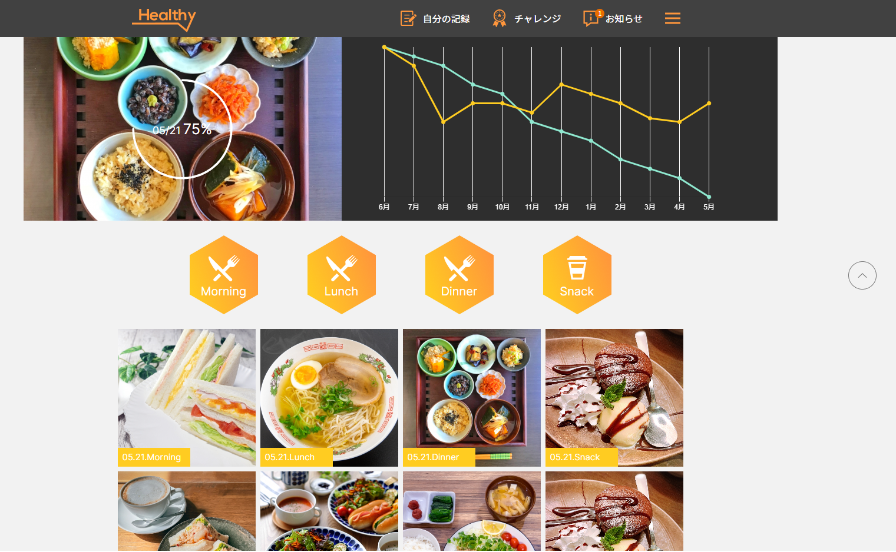

# Health App
> This is an application that helps you improve your health by managing your diet, exercise regimen, and rest

## Table of Contents
* [General Info](#general-information)
* [Technologies Used](#technologies-used)
* [Features](#features)
* [Screenshots](#screenshots)
* [Setup](#setup)
* [Usage](#usage)
* [Project Status](#project-status)
* [Acknowledgements](#acknowledgements)
* [Contact](#contact)

## General Information
- Health is an important issue, but how to have good health in today's busy life
- The application was born to help people improve their health by helping you live a life with a scientific schedule

## Technologies Used
- react - 18.2.0
- react-dom - 18.2.0
- react-router-dom - 6.3.0
- react-scripts- 5.0.1
- typescript - 4.7.4
- sass - 1.56.1
- chart.js - 4.0.1
- date-fns - 2.29.3
- react-chartjs-2 - 5.0.1
- react-circular-progressbar - 2.1.0

## Features
- Displays information about the amount of excess body fat, training progress, meal history 
- Notice of training, eating, and resting schedules

## Screenshots

## Setup
You just need to open Terminal, then run the command line:
- `npm install`

## Usage
In order to run it, you just need run after setup:
- `npm start`

## Project Status
Project is: _in progress_ 

## Acknowledgements
- This project was inspired by Arent Company

## Contact
Created by [Tran Hoang Loc](https://www.facebook.com/lst.tranloc) - feel free to contact me!
